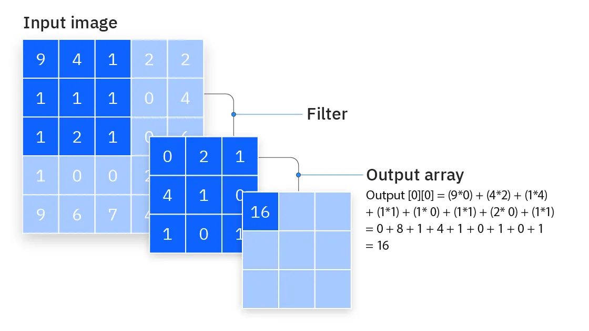

# Redes Neuronales Convolucionales
Las redes neuronales convolucionales buscan obtener einformación a partir de grids como imágenes y las hacen más pequeñas para que sea más sencillo de entender para una inteligencia artificial.

